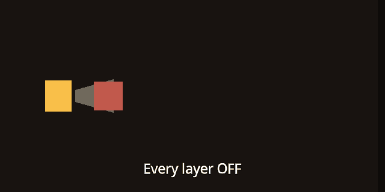
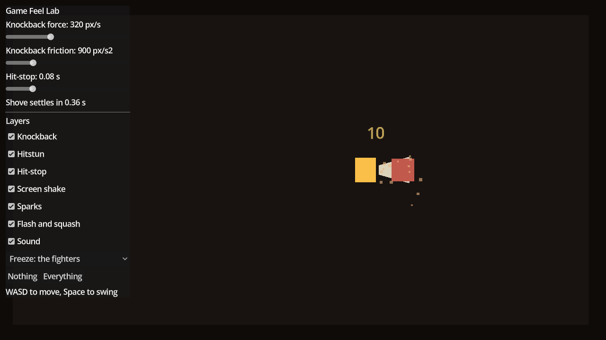

# Godot Game Feel Lab

One sword swing split into the seven things that make a hit land, each on its own
switch, so you can turn them on and off in Godot 4 while the game runs.



A hit that lands is not the same as a hit that feels like it landed. Four of these
seven layers do nothing to a screenshot, which is why this is a project you run
rather than an article you read.

## Features

- **Seven impact layers, each on a switch:** knockback, hitstun, hit-stop, screen
  shake, sparks, flash and squash, and sound.
- **Three live sliders:** knockback force, knockback friction and hit-stop length,
  with the resulting slide time shown as a number.
- **Two freeze styles:** freeze only the two fighters, or freeze the whole game
  with `Engine.time_scale`. Switch between them mid-fight.
- **Hit-stop that cannot lock up your game.** Its timer ignores time scale, and a
  token stops two quick hits from unfreezing each other early.
- **Trauma-based screen shake** on smooth noise, with a directional kick and a
  small camera roll.
- **Directional sparks** that fly along the strike instead of puffing out in a ring.
- **A hit sound generated in code**, pitch-varied so forty hits in a row never
  sound like a machine gun.
- **No assets and no addons.** Every shape is a `Polygon2D` and the sound is
  synthesised, so the whole project is about 20 KB of text.

## Demo



One room, one player, and a training dummy that walks back to its post after every
shove. The panel in the top left runs the lab. Press **Nothing**, swing a few
times, then press **Everything** and swing again.

## Requirements

- Godot **4.7** or later, standard build (GDScript only, no .NET needed).
- Tested on **Godot 4.7.2 stable** on Windows. Earlier 4.x versions are untested.
- Uses the Compatibility renderer, so it runs on older GPUs too.

## Installation

Clone the repository:

```bash
git clone https://github.com/CodingQuests/godot-game-feel-lab.git
```

Or download it with **Code > Download ZIP** and unzip it.

Then open Godot, click **Import**, pick the `project.godot` file inside the folder,
and click **Import & Edit**.

## Quick Start

1. Press **F5**.
2. Move with **WASD** or the arrow keys. Swing with **Space** or a left click.
3. Press **Nothing** in the panel and swing at the dummy. The hit lands, but it has
   no weight.
4. Press **Everything** and swing again.
5. Untick one layer at a time to hear what each one was contributing, or drag a
   slider while you swing.

## How It Works

The attack does one thing when it connects: it reports the hit.

```gdscript
GameFeel.report_hit(enemy.global_position, direction)
```

`GameFeel` is an autoload. It adds camera trauma, starts the hit-stop, and emits a
`hit_landed` signal. The camera and the room listen for that signal and add the
shake, the sparks, the damage number and the sound. The attack code never touches
any of them, so adding a new reaction later means writing that reaction, never
opening the attack again.

### The seven layers

| Layer | What it does | Where |
|---|---|---|
| Knockback | The hit shoves the target | `enemy.gd` |
| Hitstun | The target cannot act while the shove lasts | `enemy.gd` |
| Hit-stop | Both fighters hold still for a few frames | `game_feel.gd` |
| Screen shake | Trauma squared, on smooth noise, with roll | `shake.gd` |
| Sparks | Particles along the strike, not in a ring | `impact.gd` |
| Flash and squash | White for five frames, then it deforms | `enemy.gd` |
| Sound | A crack and a falling tone, pitch varied | `hit_sound.gd` |

### The three numbers

Everything else is fixed. These are the ones worth arguing about.

| Number | What it does | Starts at |
|---|---|---|
| `knockback_force` | How hard the hit shoves, in pixels per second | 320 |
| `knockback_friction` | How fast that shove bleeds off, in pixels per second squared | 900 |
| `hitstop_duration` | How long the fighters freeze, in real seconds | 0.08 |

Force and friction together decide how long the target slides:

```
settle time = knockback_force / knockback_friction
```

So 320 force against 900 friction settles in about a third of a second. Raising
force on its own makes the shove travel further and last longer. If you want a big
shove that snaps back fast, raise friction with it.

Hit-stop is the one that surprises people. Real action games sit between about
0.05 and 0.2 seconds, which is 3 to 12 frames at 60fps, and scale it with how
heavy the attack is. Set it to 0 and swing, then set it to 0.08 and swing again.

### The one bug everybody writes

Hit-stop is `Engine.time_scale = 0.0`, wait, then set it back to 1.0. The obvious
way to wait is the one that breaks:

```gdscript
# Freezes your game forever.
Engine.time_scale = 0.0
await get_tree().create_timer(duration).timeout
Engine.time_scale = 1.0
```

`create_timer` runs on scaled time by default. At a time scale of zero it never
finishes, so the line that unfreezes the game never runs. The fourth argument is
`ignore_time_scale`, and it is the whole fix:

```gdscript
await get_tree().create_timer(duration, true, false, true).timeout
```

`game_feel.gd` also carries a token, so two hits close together cannot end with
the first one's timer unfreezing a game the second one still wants frozen.

### A freeze should not stop everything

When you freeze on impact, freeze the **fighters**. Let the sparks keep flying,
the camera keep shaking, and the damage number keep climbing. A total freeze reads
as a dropped frame, because that is what a dropped frame looks like. A freeze with
the effects still running reads as impact.

`Engine.time_scale = 0.0` is the one line version and it stops everything. It is
fine at 3 or 4 frames. At 12 frames it feels like the game hitched. The other
style is a `frozen` flag that only the two bodies check:

```gdscript
func _physics_process(delta: float) -> void:
	if GameFeel.frozen:
		velocity = Vector2.ZERO
		return
```

Both are implemented. Switch between them in the panel and swing.

## Project Structure

```
project.godot             Project file, the GameFeel autoload and the input actions
scenes/main.tscn          The room: walls, the camera, the player, the dummy, the panel
scenes/player.tscn        Player body and the blade
scenes/enemy.tscn         The training dummy you hit
scripts/game_feel.gd      The three numbers, the layer switches, the freeze, the trauma
scripts/player.gd         Movement, the swing, and the hit that starts everything
scripts/enemy.gd          Knockback, hitstun, flash and squash
scripts/world.gd          Listens for the hit signal and spawns the world effects
scripts/shake.gd          Trauma squared camera shake on smooth noise
scripts/impact.gd         Spark burst along the strike
scripts/damage_number.gd  The floating number
scripts/hit_sound.gd      The impact sound, generated in code
scripts/lab_ui.gd         The panel. Tooling, not example code. Safe to delete
```

## Using It In Your Own Game

Take only the layers you want. Everything depends on the `GameFeel` autoload, and
nothing depends on the panel.

| You want | Copy | Then |
|---|---|---|
| Hit-stop and the hit signal | `scripts/game_feel.gd` | Add it as an autoload named `GameFeel` (Project > Project Settings > Globals) |
| Screen shake | `scripts/shake.gd` | Attach it to your `Camera2D` |
| Sparks, damage numbers, sound | `impact.gd`, `damage_number.gd`, `hit_sound.gd`, `world.gd` | Attach `world.gd` to your level's root node, or call the three helpers from your own script |
| Knockback, hitstun, flash and squash | `apply_knockback`, `is_recovering`, `react` and the `_physics_process` branches from `scripts/enemy.gd` | Merge them into your enemy script |

On a landed hit, report it:

```gdscript
enemy.apply_knockback(direction, GameFeel.knockback_force)
enemy.react()
GameFeel.report_hit(enemy.global_position, direction)
```

Whatever gets hit needs the lines that let a shove move it. From
`scripts/enemy.gd`, trimmed:

```gdscript
func _physics_process(delta: float) -> void:
	if GameFeel.frozen:
		velocity = Vector2.ZERO
		return
	if is_recovering() and GameFeel.hitstun_enabled:
		velocity = _knockback
		_knockback = _knockback.move_toward(Vector2.ZERO, GameFeel.knockback_friction * delta)
	else:
		velocity = your_normal_movement()
	move_and_slide()


func apply_knockback(direction: Vector2, force: float) -> void:
	_knockback = direction.normalized() * force


func is_recovering() -> bool:
	return _knockback.length() > 4.0
```

`move_toward` walks a value toward a target by a fixed step each frame, so the
slide always ends at exactly zero instead of creeping.

`react()` flashes a `Polygon2D` by changing its `color`. On a `Sprite2D`, tween
`modulate` or use a flash shader instead.

## Customizing It

- **Default feel:** change the starting values of `knockback_force`,
  `knockback_friction` and `hitstop_duration` at the top of `game_feel.gd`.
- **Heavier attacks:** call `GameFeel.hit_stop(0.15)` for a big hit and
  `GameFeel.hit_stop(0.05)` for a jab, instead of one fixed duration.
- **Shake strength:** `MAX_OFFSET`, `MAX_ROLL`, `FREQUENCY` and `KICK` in
  `shake.gd`, and `TRAUMA_PER_HIT` and `TRAUMA_DECAY` in `game_feel.gd`.
- **Sparks:** `COUNT`, `SPREAD` and the speed and lifetime ranges in `impact.gd`.
- **Sound:** `DURATION` and `PITCH_SPREAD` in `hit_sound.gd`, or swap the generated
  stream for your own audio file.
- **Window size:** the room is 640x360 drawn at 2x. Change the camera `zoom` in
  `scenes/main.tscn` together with the viewport size in Project Settings.

## Known Limitations

- Hits are detected with a distance and angle check, not `Area2D` hitboxes. That
  keeps the project about how a hit feels rather than how it is detected.
- One player and one training dummy. There is no health, death or enemy attack.
- The tunables live in one global autoload, so per-attack tuning (light versus
  heavy) is up to you. See "Heavier attacks" above.
- The "everything" freeze style sets `Engine.time_scale`, which also pauses any
  other time-scaled system in your game while it runs.
- Tested on Godot 4.7.2 on Windows only.

## License

MIT. Use it in a commercial game, take the scripts apart, ship whatever you build
with them. See [LICENSE](LICENSE).

## Third-Party Assets

None. Every shape is drawn with `Polygon2D` and the hit sound is generated in code
at runtime, so there is no art, audio or font to attribute.

## Credits

The techniques are not new. These are the people who worked them out and gave
them away; this project ports them to Godot 4 and puts them behind a swing you can
try.

- **[Juicing Your Cameras With Math](https://archive.org/details/GDC2016Eiserloh)**, Squirrel Eiserloh, GDC 2016. Trauma instead of shake, trauma squared instead of linear, smooth noise instead of random, and roll as well as offset in 2D.
- **[The Art of Screenshake](https://www.youtube.com/watch?v=AJdEqssNZ-U)**, Jan Willem Nijman, Vlambeer. A good hit is a stack of small reactions, not one big effect.
- **[Juice It or Lose It](https://gdcvault.com/play/1016789/Juice-It-or-Lose)**, Martin Jonasson and Petri Purho, GDC 2012. Squash and stretch on impact, and adding one effect at a time.
- **[Hitstop, hitfreeze, hitlag, hitpause](https://critpoints.net/2017/05/17/hitstophitfreezehitlaghitpausehitshit/)**, Celia Wagar. Why a freeze at the moment of collision reads as force.

## Learn How It Works

Want to understand how this works instead of just copying it?

CodingQuests teaches you how to build systems like this step by step in Godot,
with interactive lessons and real projects.

- **[Game Feel: Make Combat Hit](https://codingquests.io/quests/game-feel-combat?utm_source=github&utm_medium=resource&utm_campaign=godot_game_feel_lab)** builds one reusable juice autoload and ends with a single `Juice.hit(weight)` call that scales every effect to the size of the blow.
- **[The browser version of this lab](https://codingquests.io/godot-game-feel-lab?utm_source=github&utm_medium=resource&utm_campaign=godot_game_feel_lab)** runs the same numbers with nothing to install.
- New to Godot? **[2D Roguelike: Top-Down Controller](https://codingquests.io/quests/2d-roguelike-controller?utm_source=github&utm_medium=resource&utm_campaign=godot_game_feel_lab)** is free, 8 lessons, written and graded in the browser.

Made by [CodingQuests](https://codingquests.io/?utm_source=github&utm_medium=resource&utm_campaign=godot_game_feel_lab).
